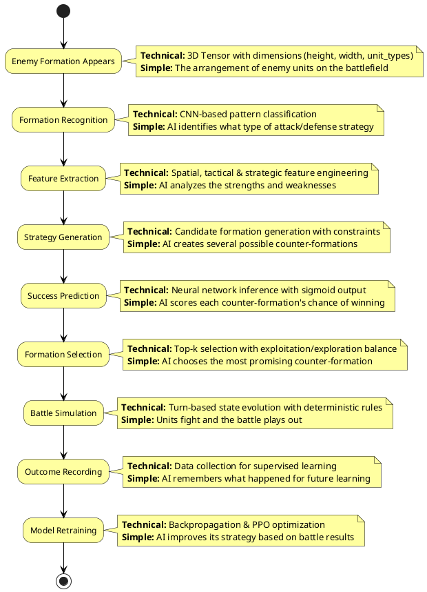

# Battle AI System: Technical & Simplified Explanation

This document provides both technical and simplified explanations of the AI system in the Battleground Simulator.

## Complete System Architecture (UML)

```plantuml
@startuml "Battle AI System Architecture"

' Color definitions
!define PURPLE #C0A0FF
!define BLUE #A0C0FF
!define GREEN #A0FFC0
!define YELLOW #FFFFA0
!define RED #FFA0A0
!define GRAY #E0E0E0

skinparam class {
    BackgroundColor GRAY
    ArrowColor black
    BorderColor black
}

skinparam note {
    BackgroundColor YELLOW
    BorderColor black
}

package "Core Components" {
    class BattleSimulator {
        + simulate_battle()
        + generate_random_formation()
        + calculate_battle_outcome()
        - _apply_damage()
        - _move_units()
    }
    
    class BattlefieldState {
        + unit_positions: 3D Tensor
        + calculate_health()
        + get_unit_at(x, y)
    }
    
    class BattleDataCollector {
        - battle_history: List
        + record_battle()
        + get_training_data()
    }
}

note bottom of BattleSimulator
  <b>In Simple Terms:</b>
  The engine that runs the battles and 
  calculates who wins based on unit
  positions and stats
end note

package "Formation Recognition System" <<PURPLE>> {
    class FormationRecognizer {
        - conv_layers: List<Conv2D>
        - fc_layers: List<Linear>
        + forward(formation: Tensor): PatternVector
        + classify_formation(formation): PatternType
        + extract_features(formation): FeatureVector
    }
    
    class FeatureExtractor {
        + extract_spatial_features()
        + extract_tactical_features()
        + extract_strategic_features()
    }
    
    class PatternDatabase {
        - known_patterns: Dict
        + get_similar_patterns()
        + record_new_pattern()
    }
}

note bottom of FormationRecognizer
  <b>In Simple Terms:</b>
  AI's "eyes" that recognize enemy
  formation patterns (like how you
  recognize faces in photos)
end note

package "Strategy Generation System" <<BLUE>> {
    class StrategyRecommender {
        - predictor: StrategyPredictor
        + recommend_formations(enemy_formation): List<Formation>
        + evaluate_formation(enemy, home): float
        - _generate_candidates(): List<Formation>
    }
    
    class StrategyPredictor {
        - enemy_cnn: CNN
        - home_cnn: CNN
        - fc_network: NeuralNetwork
        + predict_success_probability(enemy, home): float
        - _forward(enemy, home): Tensor
    }
    
    class FormationGenerator {
        - templates: List<Formation>
        + generate_from_template()
        + apply_constraints()
        + ensure_diversity()
    }
}

note bottom of StrategyRecommender
  <b>In Simple Terms:</b>
  AI's "brain" that creates battle plans
  to counter the enemy formation
end note

package "Reinforcement Learning System" <<GREEN>> {
    class BattleEnvironment {
        - simulator: BattleSimulator
        - observation_space: Box
        - action_space: Box
        + reset(): Observation
        + step(action): Tuple<Observation, Reward, Done, Info>
        - _calculate_reward(): float
    }
    
    class PPOAgent {
        - policy: ActorNetwork
        - value: CriticNetwork
        - buffer: ExperienceBuffer
        + predict(observation): Action
        + learn(total_timesteps): self
        - _update_policy()
    }
    
    class RewardSystem {
        + battle_outcome_reward()
        + health_differential_reward()
        + diversity_bonus()
    }
}

note bottom of PPOAgent
  <b>In Simple Terms:</b>
  AI's "experimentation lab" where it
  tries different strategies and learns
  from wins and losses
end note

package "Training System" <<RED>> {
    class ModelTrainer {
        + train_formation_recognizer()
        + train_strategy_predictor()
        + train_reinforcement_agent()
        - _prepare_training_data()
    }
    
    class LearningRateScheduler {
        + step_decay()
        + cosine_annealing()
    }
    
    class PerformanceEvaluator {
        + evaluate_win_rate()
        + evaluate_unit_diversity()
        + analyze_formation_effectiveness()
    }
}

note bottom of ModelTrainer
  <b>In Simple Terms:</b>
  AI's "school" where it learns from
  past battles to make better decisions
end note

' Relationships
BattleSimulator --> BattlefieldState: creates >
BattleSimulator --> BattleDataCollector: provides data to >

FormationRecognizer --> FeatureExtractor: uses >
FormationRecognizer <-- PatternDatabase: informs <

StrategyRecommender --> StrategyPredictor: uses >
StrategyRecommender --> FormationGenerator: uses >
StrategyRecommender --> FormationRecognizer: receives input from >

BattleEnvironment --> BattleSimulator: wraps >
BattleEnvironment --> RewardSystem: uses >
PPOAgent --> BattleEnvironment: interacts with >

ModelTrainer --> BattleDataCollector: gets data from >
ModelTrainer --> FormationRecognizer: trains >
ModelTrainer --> StrategyPredictor: trains >
ModelTrainer --> PPOAgent: trains >
ModelTrainer --> LearningRateScheduler: uses >
ModelTrainer --> PerformanceEvaluator: uses >

' Main flow connections
BattlefieldState <-- FormationRecognizer: analyzes <
FormationRecognizer --> StrategyRecommender: informs >
StrategyRecommender --> BattleSimulator: provides formations to >
PPOAgent --> BattleSimulator: provides formations to >

@enduml
```

## Decision Flow Diagram

## The AI Process: Technical and Simplified Explanation

### 1. Formation Recognition

**Technical Explanation**: 
The enemy formation is represented as a 3D tensor with dimensions (grid_height, grid_width, unit_types). This spatial data is processed through a convolutional neural network (CNN) designed to recognize tactical patterns. The CNN performs feature extraction through multiple convolutional layers with ReLU activations and max pooling, followed by fully connected layers that classify the formation into known patterns or extract a feature vector for further processing.

**Simplified Explanation**:
Think of this as the AI's "eyes" - it looks at the enemy formation and recognizes patterns, similar to how you might recognize a flanking maneuver or a defensive position. It's like a chess player who recognizes standard openings and knows their strengths and weaknesses.

### 2. Strategy Generation

**Technical Explanation**:
The strategy generation system employs a multi-stage candidate production pipeline. It begins with template-based generation using known effective formations, then applies heuristic adaptations based on the enemy composition and position. The system employs constraint satisfaction algorithms to ensure all formations meet unit budget and count limits. Monte Carlo sampling introduces controlled randomization to explore the strategy space efficiently.

**Simplified Explanation**:
This is the AI's "creative process" - it thinks up different possible counter-formations. Some are based on tried-and-true strategies it knows work well against certain enemy formations. Others might be variations or entirely new approaches if it's using reinforcement learning.

### 3. Formation Evaluation

**Technical Explanation**:
Each candidate formation is evaluated using a Siamese CNN architecture that processes both the enemy and candidate formations in parallel branches. These representations are combined and processed through fully connected layers with dropout regularization, culminating in a sigmoid activation that outputs a win probability between 0 and 1. Maximum diversity sampling ensures strategic variety in the recommendations.

**Simplified Explanation**:
This is like the AI "simulating the battle in its head" - for each possible counter-formation, it estimates how likely it is to win against the enemy. It's similar to a chess player thinking "If I move here, then they'll probably do this, and then I'll do that..."

### 4. Reinforcement Learning (Optional)

**Technical Explanation**:
The reinforcement learning system uses Proximal Policy Optimization (PPO), an actor-critic algorithm that maintains two networks: a policy network that determines actions (formations) and a value network that estimates expected returns. The system uses a custom Gym environment wrapper around the battle simulator. Critical hyperparameters include an entropy coefficient of 0.01 to encourage exploration, a clipping parameter of 0.2 to limit policy updates, and a learning rate of 3e-4 with linear decay.

**Simplified Explanation**:
This is the AI's "trial and error learning" - it tries different strategies, sees which ones win battles, and gradually improves its approach. It's like learning to play a video game by practicing, where you get better over time by learning from your mistakes.

### 5. Training Process

**Technical Explanation**:
The supervised learning components are trained using backpropagation with the Adam optimizer. The formation recognizer uses cross-entropy loss for pattern classification, while the strategy predictor uses binary cross-entropy for win prediction. Regularization includes dropout (p=0.3), L2 weight decay (1e-4), and batch normalization. Learning rate scheduling uses cosine annealing with restarts to escape local minima.

**Simplified Explanation**:
This is how the AI "studies" - it reviews the results of past battles, notices which strategies worked well against which enemy formations, and updates its understanding. The more battles it sees, the smarter it gets, just like how students learn from doing many practice problems.

### 6. Why You Might See Repeated Strategies

**Technical Explanation**:
The system may exhibit exploitation bias, where it converges to a local optimum in the strategy space. This is addressed through entropy regularization in the PPO algorithm (higher entropy coefficient encourages exploration), curriculum learning (progressively more complex scenarios), experience replay with prioritized sampling, and occasionally introducing adversarial formations specifically designed to challenge current strategies.

**Simplified Explanation**:
Sometimes the AI finds a strategy that works really well and keeps using it (like finding a "winning move" in chess). If you want the AI to try more diverse strategies, the reinforcement learning settings can be adjusted to encourage more exploration, or you can retrain it with more varied battle data.

## How the Complete System Works Together

The Formation Recognition System analyzes enemy formations and feeds this information to the Strategy Generation System, which creates potential counter-formations. These are then evaluated for effectiveness, and the best formation is selected for battle. The outcomes of these battles are recorded by the Battle Data Collector and used by the Training System to improve all components through supervised and reinforcement learning techniques.

When you select "Retrain Models" in the menu, you're initiating a transfer learning process that preserves the learned representations in the existing models while adapting them to incorporate new strategic information from recent battles. This continuous learning cycle allows the AI to become progressively more effective at countering enemy strategies. 