# AI Strategy Logic: Technical Overview

This diagram explains how the AI system processes battlefield information and generates strategic formations.

```mermaid
graph TD
    subgraph "User Interface Layer"
        A[Enemy Formation] --> B[AI Analysis Pipeline]
        B --> C[Counter-Formation]
        C --> D[Battle Simulation]
    end

    subgraph "Neural Network Processing"
        A1[Enemy Formation<br>3D Tensor] --> B1[Convolutional Neural Network<br>Formation Recognizer]
        B1 -->|"Pattern Classification<br>Feature Extraction"| C1[Strategy Template Database]
        
        A1 --> D1[Feature Engineering]
        D1 -->|"Spatial & Tactical<br>Feature Vectors"| E1[Unit Distribution Analysis]
        
        C1 --> F1[Strategy Recommender]
        E1 --> F1
        F1 -->|"Candidate Generation<br>with Constraints"| G1[Success Predictor CNN]
        
        G1 -->|"Win Probability<br>Sigmoid Output"| H1[Top-k Formations]
        
        H1 -->|"Maximum Probability<br>Selection"| I1[Optimized Counter-Formation]
        
        subgraph "Supervised Learning Pipeline"
            J1[Historical Battle Data] --> K1[Backpropagation Training]
            K1 -->|"Cross-entropy Loss<br>Gradient Descent"| L1[Trained Neural Networks]
            L1 --> F1
        end
        
        subgraph "Reinforcement Learning Pipeline"
            M1[Gym Environment] --> N1[PPO Agent]
            N1 -->|"Action Space<br>Exploration"| O1[Reward Function]
            O1 -->|"Policy Optimization<br>Value Estimation"| P1[Actor-Critic Network]
            P1 --> I1
        end
    end

    style A1 fill:#f9f,stroke:#333,stroke-width:2px
    style I1 fill:#9cf,stroke:#333,stroke-width:2px
    style L1 fill:#9f9,stroke:#333,stroke-width:2px
    style P1 fill:#ff9,stroke:#333,stroke-width:2px
```

## Technical Explanation

### The AI Pipeline

1. **Formation Recognition (CNN-based Pattern Classification)**:
   - The enemy formation is represented as a 3D tensor (height × width × unit_types)
   - A convolutional neural network (CNN) processes this spatial data
   - The CNN extracts features and classifies the formation into tactical patterns
   - Feature engineering extracts spatial, tactical, and strategic metrics

2. **Strategy Generation (Multi-stage Candidate Production)**:
   - Template-based generation draws from known effective formations
   - Heuristic adaptation modifies templates based on enemy composition
   - Constraint satisfaction ensures all formations meet unit budget and count limits
   - Monte Carlo sampling introduces controlled randomization

3. **Formation Evaluation (Neural Network Inference)**:
   - Each candidate formation is paired with the enemy formation
   - A siamese CNN architecture processes both formations
   - The network outputs a win probability score through a sigmoid activation
   - Diversity is ensured via maximum diversity sampling

4. **Selection Algorithm**:
   - Top-k candidates are selected based on predicted success probability
   - Final selection balances exploitation (highest probability) vs. exploration

### Training Methodologies

The system employs two complementary machine learning approaches:

1. **Supervised Learning Pipeline**:
   - Training data: {(enemy_formation, home_formation, battle_outcome)} tuples
   - Loss function: Binary cross-entropy for win prediction
   - Optimization: Adam optimizer with learning rate scheduling
   - Regularization: Dropout (p=0.3) and L2 weight decay
   - Architecture: Convolutional layers for spatial feature extraction followed by fully connected layers

2. **Reinforcement Learning Pipeline (PPO Implementation)**:
   - Environment: Battle simulator wrapped in OpenAI Gym interface
   - State space: Enemy formation tensor
   - Action space: Home formation placement decisions
   - Reward function: Win/loss outcome (±1.0) + normalized health differential
   - PPO hyperparameters:
     * Entropy coefficient: 0.01 (encourages exploration)
     * Value function coefficient: 0.5
     * Clip range: 0.2
     * Learning rate: 3e-4 with linear decay

### Performance Optimization Strategies

If the model shows convergence to limited unit types (exploitation bias):

- **Entropy regularization**: The higher entropy coefficient (0.01) encourages exploration
- **Curriculum learning**: Training progressively on more complex scenarios
- **Experience replay**: Storing and reusing diverse battle experiences
- **Adversarial training**: Deliberately generating challenging enemy formations

The "Retrain Models" option employs a form of transfer learning, where existing models are fine-tuned with new battle data, preserving learned representations while adapting to new strategic information. 